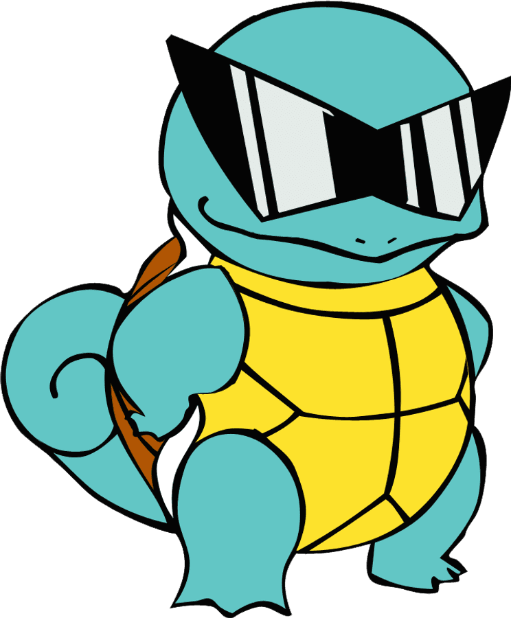

# git and git-hub laboratory
Git practice laboratory

Santiago Cordova

## Descriptions
This repository is going to be used to learn the basic skills for github.

## Contents

### Images

## References
[Github documentation](https://docs.github.com/en) 

[Github glossary](https//docs.github.com/en/get-started/learning-about-github/github-glossary)

[Git documentation](https://wallpapers.com/images/high/squirtle-sunglasses-cool-pose-gjgzdgdtizy2xynk.png)

